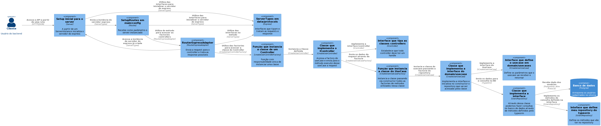
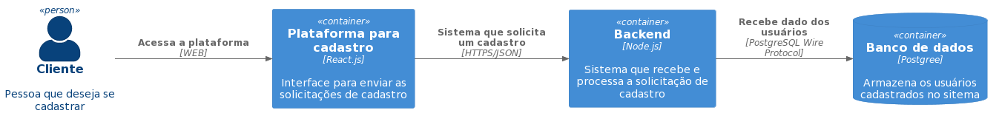

# Bemol OnBoarding API

- Este projeto consiste numa API para cadastro de usuários, listagem de usuários e atualização destes dados. Utiliza conceitos de DDD, Clean Architecture e princípios SOLID. Feito para o processo seletivo de software engineer da Bemol.

# 🧰 Technologies

- API
  - NodeJS
  - TypeScript
  - Jest
  - Docker
  - PostgreSQL
  - Eslint
  - TypeORM
- Architecture
  - Clean architecture

# 🚀 Como Usar

### 💾 Clone o Repositório

```
- git clone git@github.com:WalmirLucena/bemol-onboarding-api.git
```

## Executando o projeto

É recomendável que você utilize o docker e docker-compose para rodar o projeto na sua máquina.

- Subindo os containeres com docker:

  ```
   - docker-compose up
  ```

  O Código acima deve subir o container tanto com a API quanto o Banco de Dados(Postgree)

  📋 Verifique o Servidor em http://localhost:3001

# Como Testar a Api

Os testes da API foram feitos usando jest, para rodar todos os testes rode o seguinte comando:

```
  yarn test
```

Para rodar um teste especifico:

```
  yarn test nomeDoArquivo
```

# Arquitetura do Projeto



# Modelo C4 da Solução do Desafio Bemol


