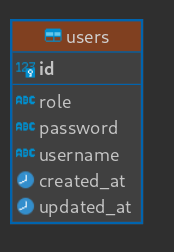
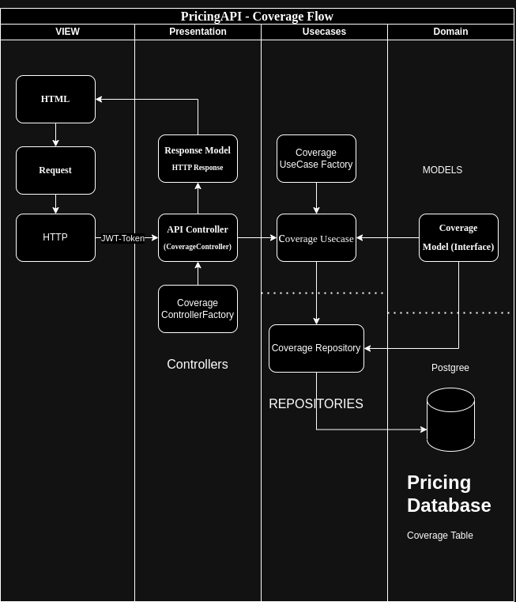
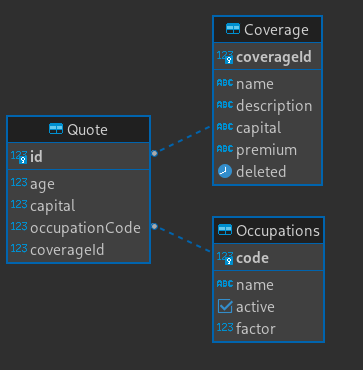

# Life Insurance Price Master ARquitetura

## Identity-API

Este desafio foi dividido em duas APIs, a primeira consiste em uma API de Autenticação e Cadastro de Usuários - Identity API.
Para Isto, primeiramente defini que seria utilizado um banco de dados relacional(`Postgres`) pois garantem mais consistência e integridade de Dados em comparação a um não relacional.
Optei por usar um ORM para acelerar o desenvolvimento, o escolhido foi o `TypeORM` por ter mais familiaridade.
Definido esses pontos, decidi utilizar a `CLEAN ARQUITECTURE`, pois além de ser um admirador dessas práticas, acredito que ela promove alguns vantagens quando utilizada, dentre essa vantagens estão:

- `Separação de Responsabilidades`: Promove uma separação de responsabilidades entre camadas o que gera mais confiabilidade ao código.
- `Testabilidade`: Por manter as camadas separadas, consequentemente fica mais fácil de testar essas partes de código
- `Facilita manutenção futura`: As alterações podem ser feitas em partes específicas do sistema sem afetar outras áreas.
- `Escalabilidade`: A arquitetura limpa fornece uma robustez para escalabilidade.

As principais camadas e estruturas de pastas desse projeto são: `Presentation`, `Main`, `Infra`, `Domain` e `Data`.

O Primeiro passo foi definir qual seria o UserModel em Domain que nada mais é que a interface que define os dados a serem recebidos e tratados.
USerModel

```json
{
    "id": <number>,
  "password": <string>,
  "username": <string>,
  "role": <string>,
}
```



A partir do momento que defini meu domínio, posso ir para a camada de `Data` que é onde tem as principais regras de negócio. Nela está contida os usecases que são um dos pilares da Clean Arquitecture. Essa camada é alimentada no constructor pelos `Repositories` que é onde está contida os métodos de manipulção com o Banco de Dados.
Finalizado essas duas partes, a proxima seria o `Presentation` lá está contido os controllers que são uma das ultimas camadas da aplicação.
Vale Lembrar que durante todo o desenvolvimento foi utilizado factories que estão contidas em `Main` que é uma forma de _Abstrair Dependências_, _Desacoplar Classes_ e além de ser um Padrão de Projeto, o _Factory Method_

## Pricing Api

A seguir será exibido um diagrama das camadas da aplicação, o exemplo utiliza a Pricing API:
/home/walmirlucena/Downloads/swe-3-life-insurance-pricing/swe-3-life-insurance-pricing-master/docs/assets/Arquicture.png




O Algoritmo para a solução do Dynamic Pricing está contido em _pricing-api/src/main/adapters/checkAgeFactorAdapter/checkAgeFactorAdapter.ts_. E consiste em um código que utiliza uma árvore binária de busca, onde a partir de uma idade encontra um fator de risco para essa idade.
Define uma classe chamada NodeBinarySearch que representa um nó para uma árvore, cada nó tem idade, fator e referências para os nós (left, Right). Dentro da Classe CheckAgeFactorAdapter tem o método insert que é responsável por inserir um novo nó na árvore binária de busca e o método insertNode que auxilia na inserção de um novo nó, mantendo a ordem correta.
Já os metodos findFactor e findFactorNode buscam o fator a partir de uma idade e retornam o fator de maior valor caso ele esteja dentro de um intervalo.
